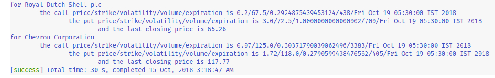

# Delta - Simplified Option Price Retriever

A simple application which uses *https://query1.finance.yahoo.com/v7/finance/options* to search and fetch the option price from the **S&P500** (and the last closing equity price) which has the highest volume.  

* * *
### REQUIREMENTS:

1. sbt >= 1.1.x

2. java == openjdk version "1.8.0\_181" for Linux Ubuntu [16/18].04.1 x86\_64 GNU/Linux || java version "8.0.x" or above for Windows 7 x64

3. scala == 2.11.8 (advanced versions of scala [e.g. 2.12.4 or 2.12.6] can be used but then the extension of guageOps via spark may not be possible; since spark and commons-math3 still run on 2.11.8).
* * *
### TO COMPILE:

Navigate to the folder and execute `$ sbt compile` or `$ sbt run` in the terminal.
* * * 
### USAGE:

```$ sbt "run 5"```
gives the result for first 5 entities in values.txt

```$ sbt "run RDS-A CVX"```
gives the result for Royal Dutch Shell and Chevron. The pattern is extensible, e.g. `$ sbt "run RDS-A CVX SNAP AAPL [...]"`  
#### output for `$ sbt "run RDS-A CVX"`  


```$ sbt run```
gives the result for first 10 instruments of the **S&P 500**.  

```scala> delta.main(Array("100"))```
gives the result for first 100 instruments of the **S&P 500** in `sbt console`.  


* * *		
### ENVIRONMENT:

The following platforms have been tested.

1. a) Linux 4.15.0-34[36]-generic #37[39]~16[18].04.1-Ubuntu x86\_64 GNU/Linux  
   b) openjdk version "1.8.0\_181"  
   c) OpenJDK Runtime Environment (build 1.8.0\_181-8u181-b13-0ubuntu0.16.04.1-b13)  
   d) OpenJDK 64-Bit Server VM (build 25.181-b13, mixed mode)  
   e) sbt version 1.2.4  

2. a) Windows 7 Professional 6.1.7601 Service Pack 1 Build 7601  
   b) java version "10.0.2" 2018-07-17  
   c) Java(TM) SE Runtime Environment 18.3 (build 10.0.2+13)  
   d) Java HotSpot(TM) 64-Bit Server VM 18.3 (build 10.0.2+13, mixed mode)  
   e) sbt version 1.1.6  

* * *
### NOTE:

1. *https://query1.finance.yahoo.com/v7/finance/options* is not a very reliable api. Being public, occasionally it may depict erratic/erroneous results. In any case, this API is not meant to be used in a production-grade code.

2. Since it was orginally written as fast-prototyped testbed for [Chapel](https://chapel-lang.org/), therefore, to make the transistional understanding more intutitive the code explicitly uses `return` statements; though for a functional language like scala, it is not necessarily recommended.

* * *
### LICENSE:

 Delta Version 1.6.1 Simplified Option Price Retriever  
 Copyright (C) 2018  A. Madhur  

 This program is free software: you can redistribute it and/or modify it under the terms of the GNU General Public License as published by the Free Software Foundation, either version 3 of the License, or
 (at your option) any later version.

 This program is distributed in the hope that it will be useful, but WITHOUT ANY WARRANTY; without even the implied warranty of MERCHANTABILITY or FITNESS FOR A PARTICULAR PURPOSE.  See the GNU General Public License for more details.

 You should have received a copy of the GNU General Public License along with this program.  If not, see [GNU GPL](https://www.gnu.org/licenses/).

 This program comes with ABSOLUTELY NO WARRANTY. This is free software, and you are welcome to redistribute it under certain conditions; type delta.conditions() to see this license in terminal.
* * *
